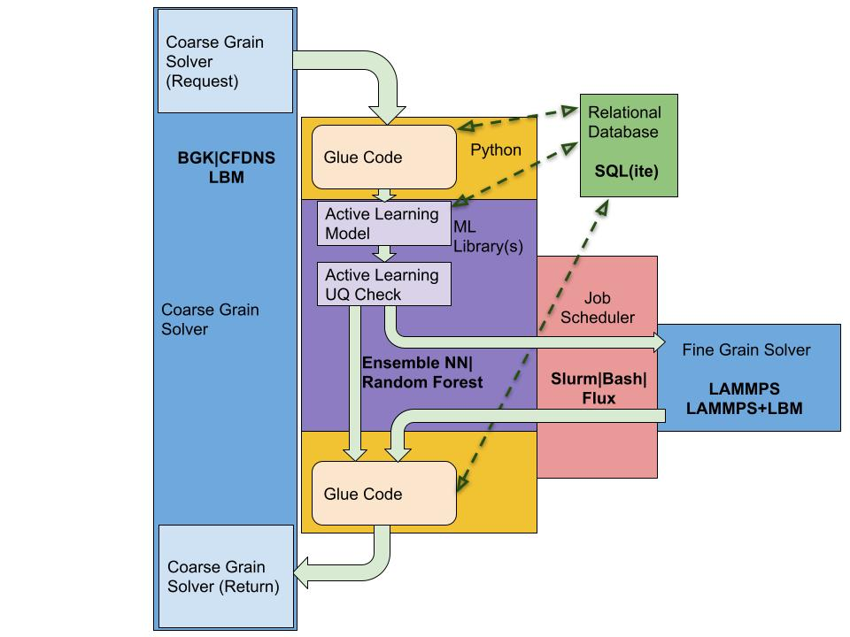

# Summary

Many scientific applications are inherently multiscale in nature. Such
complex physical phenomena often require simultaneous execution and
coordination of simulations spanning multiple time and length scales.
This is possible by combining expensive small-scale simulations (such as
molecular dynamics simulations) with larger scale simulations (such as
finite volume methods) to allow for considerably larger systems using
task and data parallelism. However, the granularity of the tasks can be
very large and often leads to load imbalance. Traditionally, we use
approximations to streamline the computation of the more costly
interactions and this introduces trade-offs between simulation cost and
accuracy. In recent years, the available computational power and the
advances in machine learning have made computing these scale-bridging
interactions and multiscale simulations more feasible.

One driving application has been plasma modeling and inertial
confinement fusion (ICF) which is fundamentally multiscale in nature.
This requires deep understanding of how to extrapolate microscopic
information into macroscopically relevant scales. For example, in ICF
one needs an accurate understanding of the connection between
experimental observables and the underlying microphysics. The properties
of the larger scales are often affected by the microscale behavior
incorporated usually into the equations of state and ionic and
electronic transport coefficients [@liboff1959transport;@rinderknecht2014first;@rosenberg2015assessment;ross2017transition]. 
Instead of incorporating this
information using reliable molecular dynamics (MD) simulations, one
often needs to use theoretical models, due to the inability of MD to
reach engineering scales [@glosli2007extending;@marinak1998comparison]. 
One way to resolve this issue is by enabling
scale bridging between MD simulations and meso- and macroscale models.

# State of the art

Traditionally, multiscale simulations combine multiple simulation
methods that need to be simultaneously executed and coordinated. To
achieve this, we use asynchronous task-based runtime systems that
include load balancers. Such load balancers can schedule and migrate
tasks to maintain throughput; however, the issue of fault tolerance
remains [@cappello2009fault]. To avoid this, checkpointing is often 
used [@koo1987checkpointing], but it could be
prohibitively expensive when its output frequency is high. Other works
such as the `mystic` framework [@mysticGit] is more geared towards large-scale
machine learning techniques [@mckerns2012building]. Such codes are not designed toward
coupling multiscale simulations but have been demonstrated to be highly
effective at solving hard optimization problems.

In this work, we propose the `G`eneric `L`earning `U`ser `E`nablement
(`GLUE`) Code to facilitate the coupling between scales. The `GLUE` Code
builds upon previous work on multiscale coupling [@haack2021enabling;
@pavel2017using:@pavel2015database]. At its simplest, we
determine what physical properties must be exchanged between the various
scales and derive application programming interfaces (APIs) from these.

To take advantage of modern supercomputing and exascale platforms and we
couple our framework directly with high-performance-computing-friendly
job schedulers. This allows us to use one framework to generate training
data with a minimal footprint (task scheduler can fire off all jobs) and
perform "hero-runs" of multiscale simulations. At every point, we
perform a fine grain simulation or utilize an upscaled result from the
active learning model. The `GLUE` Code uses active learning to evaluate
the level of uncertainty and executes fine grain simulations when more
training data is required.

# Statement of need

The `GLUE` Code is a modular framework designed to couple different
scientific applications to support use cases, including multiscale
methods and various forms of machine learning. The workflow was
initially designed around supporting active learning as an alternative
to coupled applications to support multiscale methods but has been
written in a sufficiently modular way that different machine learning
methods can be utilized. Application programming interfaces (API) are
available for C, C++, Fortran, and Python with support for various
storage formats. The code also provides direct coupling with high
performance computing job schedulers such as SLURM [@yoo2003slurm] 
and Flux [@ahn2018workflows]. An
overview of the `GLUE` Code implementation is shown in
Fig. <a href="#fig:glue_impl" data-reference-type="ref"
data-reference="fig:glue_impl">1</a>.

<figure>

<figcaption align = "center"><b>Figure 1:  </b>Sample of the GLUE Code implementation of our microscale-macroscale coupling. On the macroscale simulation (left) sending a request, the GLUE Code (center) uses the active learning algorithms (center purple) to determine if the model’s uncertainty quantification is such that a new fine grain simulation (right) needs to be called. Then either the result of the fine grain simulation or the model’s prediction is returned to the macroscale simulation. This figure is adapted from Fig. 2 in Diaw et al. [@diaw2020multiscale].
  
</figcaption>
  
</figure>
 
 
 

The aim of the `GLUE` Code is to efficiently handle the communication
and interfaces between the computing platform, surrogate model,
coarse-scale code, and fine-scale code [@diaw2020multiscale]. 
At its core, the `GLUE` Code
determines what physical properties need to be exchanged between the
scales of interest and spawns APIs using this information. The `GLUE`
Code ensures that these physical properties are communicated between the
various scientific codes needed for the given multiscale problem. The
`GLUE` Code uses active learning algorithms to evaluate if the model has
a high level of uncertainty, and thus, a fine grain simulation needs to
be executed. At the end of each cycle, the framework returns either the
result of the fine grain simulation or the model’s prediction of the
macroscopic simulation.

Characteristics of the `GLUE` code:

-   The `GLUE` Code has a modular lightweight structure, where each
    component can be swapped out for a different implementation. This is
    possible due to the APIs structure of the framework.

-   The modularity of the `GLUE` code allows us to replace a scientific
    solver with a machine learning solution. The scale bridging
    structures are explicitly defined, which allows us to switch between
    a fine grain MD simulation and an ML solution. If a neural network
    is capable of reproducing the same outputs as an MD simulation from
    the same inputs, then they would be functionally identical.

-   As shown in Fig. <a href="#fig:glue_impl" data-reference-type="ref"
    data-reference="fig:glue_impl">1</a>, the main components of the
    `GLUE` Code are a Coarse Grain Solver, an active learning backend, a
    relational database, a job scheduler, and the coupling and
    coordination logic.

-   The `GLUE` Code is written with a collection of commodity software
    as the backend to most of these components. Currently, the
    relational database is supported via SQL(ite), while the job
    scheduler has support for SLURM [@yoo2003slurm], Lawrence Livermore National
    Laboratory’s Flux scheduler [@ahn2018workflows], and a rudimentary serialization model
    for debugging. Active learning is provided through PyTorch [@Neurips2019;@paszke2019pytorch] and
    Scikit-Learn [@pedregosa2011scikit].

-   This approach relies on SQL(ite) for the communication as it is a
    guaranteed atomic read and write that simplifies a lot of our
    efforts at the cost of performance.

-   For coarse grain simulations, we currently couple with the
    Multi-BGK [@lanl-bgk] as well as additional ICF codes. Preliminary studies have
    been made of coupling with more general Lattice Boltzmann
    simulations for other fields of study.

-   For fine scale simulations, we use a mixture of LAMMPS [@plimpton1995fast] and proven
    analytic solutions; however, one could easily switch to another MD
    solution as long as they have similar capabilities.

-   Since the effectiveness of machine learning methods varies depending
    on the available training data and problem, an additional check for
    any machine learning solution is added to the framework. In the
    `GLUE` Code, we query the models provided by the machine learning
    solution for the output associated with our inputs. The surrogate
    model then provides both the expected outputs and the uncertainty
    quantification to indicate its confidence that this specific model
    gave a valid answer. If the confidence is too low, the code falls
    back to calling the actual MD simulation and providing the data for
    the machine learning solution to retrain and generate a new
    surrogate model for future use.

# Code structure

The `GLUE` code is organized as follows:

-   `GLUECode_Library` contains the C++ library that is meant to be
    linked to the coarse grain solver. This allows existing applications
    to couple to the `GLUECode_Service` with minimal code alterations.

-   `GLUECode_Service` contains the python scripts that the library
    communicates with and uses a combination of active learning and
    spawning of fine grain simulation jobs to enable and accelerate
    multiscale scientific applications.

-   `docs` contains documentation for the Flux scheduler.

-   `examples` contains sniff tests for the serial and the MPI versions
    of the code, and utility scripts, such as `pullICFData.py` that
    demonstrate how the `GLUE` Code framework can be used to access
    training data to perform deeper analysis.

-   `jsonFiles` contains example input decks for the `GLUE` Code
    service.

-   `lammpsFiles` contains LAMMPS example scripts
    (`in.Argon_Deuterium_masses` and  
    `in.Argon_Deuterium_plasma`) that compute the mutual diffusion for a
    plasma composed of argon and deuterium at different concentrations
    and temperatures. More information about the test cases can be found
    within the files.

-   `training` contains training data required for active learning.

# Acknowledgements

The research presented in this article was supported by the Laboratory
Directed Research and Development program of Los Alamos National
Laboratory (LANL) under project number 20190005DR and used resources
provided by the LANL Institutional Computing Program. AP and JS
acknowledge the support of the U.S. Department of Energy through the
LANL/LDRD Program and the Center for Non-Linear Studies for this work.
LANL is operated by Triad National Security, LLC, for the National
Nuclear Security Administration of U.S. Department of Energy (Contract
No. 89233218CNA000001). This document is LA-UR-22-29746.
